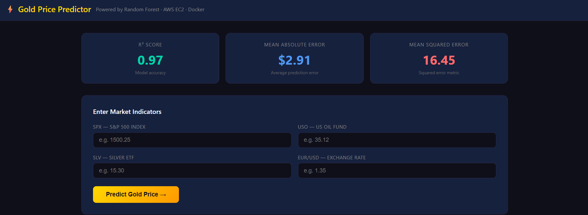
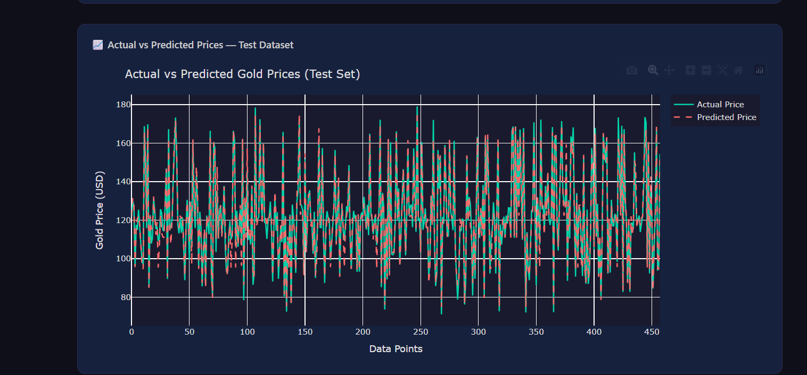
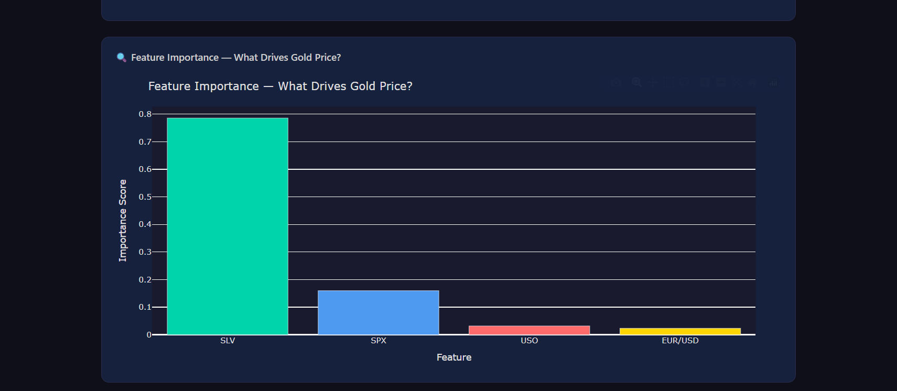

# 🥇 Gold Price Predictor

A machine learning web application that predicts gold prices from live market indicators — built with a Random Forest model, served through Flask, containerized with Docker, and deployed on AWS EC2 with a fully automated CI/CD pipeline.

**🔗 Live Demo:** [http://13.203.22.71:5000](http://13.203.22.71:5000)

---

## 📊 Overview

Gold prices don't move in isolation — they're closely tied to broader market signals like equity indices, oil prices, exchange rates, and especially silver. This project trains a **Random Forest Regressor** on historical market data to predict gold prices (GLD) from four key indicators, then wraps the model in a simple, interactive web interface anyone can use.

The app isn't just a notebook experiment — it's fully deployed and publicly accessible, with an automated pipeline that ships every code change straight to production.

---

## 🖼️ Screenshots

### Prediction Dashboard
Enter live market indicators and get an instant gold price prediction, alongside the model's key performance metrics.



### Actual vs. Predicted Prices
Visualization comparing the model's predictions against actual gold prices on the held-out test set.



### Feature Importance
Breakdown of which market indicators the model relies on most when predicting gold price.



---

## 📈 Model Performance

| Metric | Value | Description |
|---|---|---|
| **R² Score** | 0.97 | Proportion of variance in gold price explained by the model |
| **Mean Absolute Error** | $2.91 | Average prediction error |
| **Mean Squared Error** | 16.45 | Squared error metric, penalizes larger misses |

**Feature Importance:**

| Feature | Importance |
|---|---|
| SLV — Silver ETF | ~0.75 |
| SPX — S&P 500 Index | ~0.13 |
| USO — US Oil Fund | ~0.07 |
| EUR/USD — Exchange Rate | ~0.05 |

Silver (SLV) is by far the strongest predictor, reflecting the well-documented real-world correlation between gold and silver prices as precious metal / inflation-hedge assets.

> **Note on evaluation:** These metrics reflect the model's performance on the test split described above. Because gold and silver prices are highly correlated day-to-day, results can vary depending on how the train/test split is constructed (e.g. random vs. time-based). A time-based split is recommended for a more realistic estimate of performance on genuinely future, unseen data.

---

## 🧠 Input Features

| Symbol | Feature | Example |
|---|---|---|
| `SPX` | S&P 500 Index | 1500.25 |
| `USO` | US Oil Fund | 35.12 |
| `SLV` | Silver ETF | 15.30 |
| `EUR/USD` | Euro–Dollar Exchange Rate | 1.35 |

---

## 🛠️ Tech Stack

- **Modeling:** Python, Scikit-learn (Random Forest Regressor)
- **Backend:** Flask
- **Frontend:** HTML, CSS
- **Containerization:** Docker
- **Cloud:** AWS EC2
- **CI/CD:** GitHub Actions

---

## 📁 Project Structure

```
Gold-Price--Prediction-Web-App/
├── .github/workflows/     # GitHub Actions CI/CD pipeline
├── model/                 # Trained model artifacts
├── static/                # CSS and static assets
├── templates/              # HTML templates (Flask views)
├── app.py                 # Flask application entry point
├── gld_price_data.csv     # Historical training dataset
├── Dockerfile              # Container build definition
├── requirements.txt        # Python dependencies
└── README.md
```

---

## 🚀 Getting Started

### Run locally

```bash
# Clone the repo
git clone https://github.com/Kushal797-bit/Gold-Price--Prediction-Web-App.git
cd Gold-Price--Prediction-Web-App

# Install dependencies
pip install -r requirements.txt

# Run the app
python app.py
```

The app will be available at `http://localhost:5000`.

### Run with Docker

```bash
# Build the image
docker build -t gold-price-predictor .

# Run the container
docker run -p 5000:5000 gold-price-predictor
```

---

## ☁️ Deployment

The application is deployed on an **AWS EC2** instance, containerized with **Docker** for consistent, portable deployment. A **GitHub Actions** CI/CD pipeline automatically builds and deploys new changes to production on every push to `main` — no manual SSH or server intervention required.

---

## 🔮 Future Improvements

- Switch to a time-based train/test split for a more rigorous, leakage-free evaluation
- Add more macroeconomic features (interest rates, inflation data, USD index)
- Experiment with gradient boosting models (XGBoost, LightGBM) for comparison
- Add a prediction history / logging dashboard

---

## 📬 Contact

**Kushal Upadhyay**
📧 kushalupadhyay06@gmail.com

If you find this project useful, consider giving it a ⭐!
